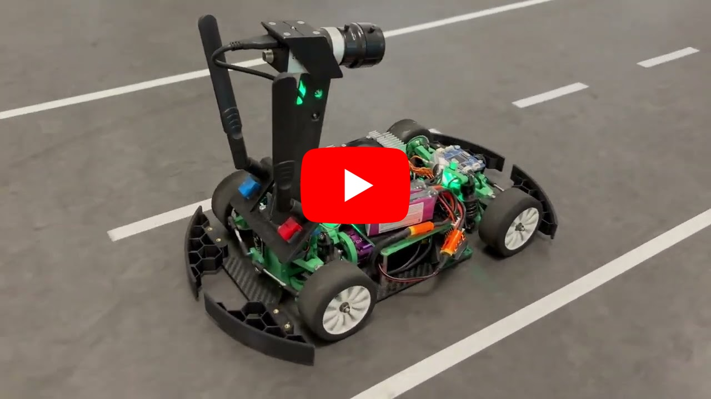
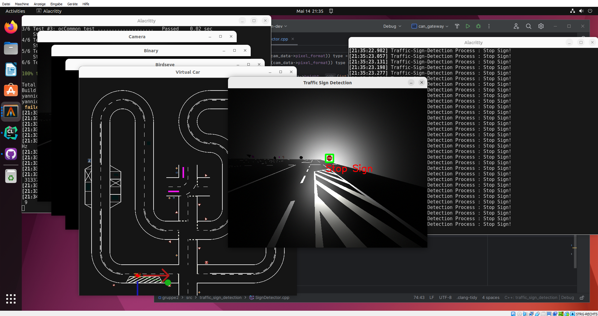

# Autonomous self-driving RC Car 🚗🕹️

Custom RC Car that only uses a camera to navigate a road course. It recognizes and reacts to dynamically placed traffic signs and junctions fully autonomously.

This is a group project for my Autonomous Vehicles University Course (This project recieved a grade of 100%)

## Live Demo 💻

Click <a href="https://youtu.be/AEA1OsS4_2U" target=_blank>here</a> or on the Video.

## Build and Run it yourself (Simulation) 🔨

Follow this [Link](https://doc.cup.ostfalia.de/) to the Ostfalia Cup Documentation